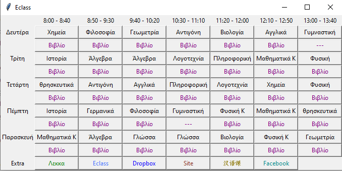

***
# eclass-webex-tkinter
A python tkinter application for webex links and lessons, including functionality to add extra buttons useful for school
End result should look like this:  


***

# config.json
##  webex_link
Webex link for your school, because you might have different subdomain.

##  book_color
Here you can set your preferred color for the book button.

##  books_folder 
The folder where you store your pdf books for class.

##  book_text
Type "book" in your preferred language.

##  days 
List of days & extra.. Again set them to your preferred language.

##  time_table
Check your schedule for the time table.

##  lessons
Example template:
```
format "name_of_lesson(button_label),teacher's_webex_id,book_pdf_file(can be set to none),day(1-5),hour(1-7)"
example "Maths,smithbrown,maths.pdf,1,3"
```
You can add classes by following the sample given in config.json

## extra
Here you can add 7 extra buttons for the needs you may have, 
for example adding your eclass link here is a good choice.
```
format "button_label,link,button_color"
example "eclass,your_eclass_link,green"
```
